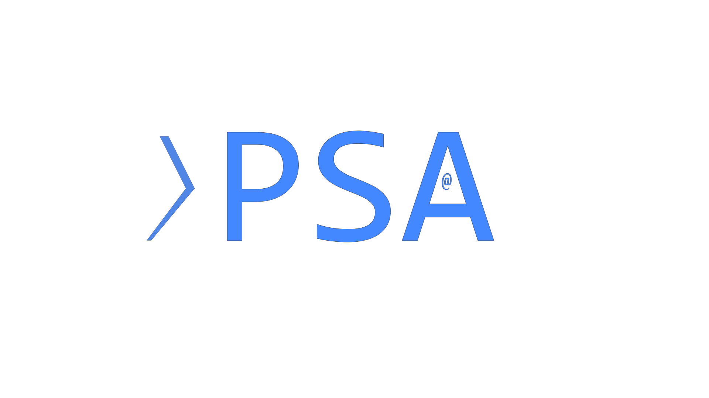
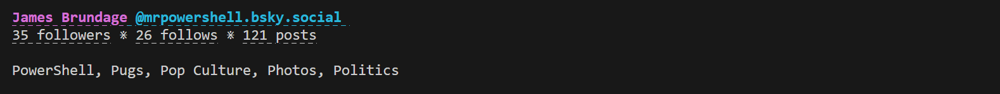

 
<a href='https://github.com/sponsors/StartAutomating'>❤️</a>
<a href='https://github.com/StartAutomating/PSA/stargazers'>⭐</a>

# PowerShell Announcements (with AtProtocol)

PSA is:

* A PowerShell Module For Making Announcements
* A Beautiful BlueSky Client for the CLI
* An (Almost) Perfect PowerShell Wrapper for the At Protocol
* A GitHub Action to Automate Annoucements

## Getting Started

To connect to AtProtocol / BlueSky with PSA, simply use Connect-BlueSky:

~~~PowerShell
$myCredential = Get-Credential # Provide your handle or email and an app-password
Connect-BlueSky -Authentication $myCredential
~~~

## Getting Profiles and Posts

Once you're connected, you can talk to every part of the At Protocol.

In the At Protocol, users are called "Actors", so, to get a profile, we'd use:

~~~PowerShell
Get-BskyActorProfile -Actor mrpowershell.bsky.social
~~~

You'll see a nice snapshot of a profile:

While this might look nice, it's actually a full object.

You can explore what that object can do by piping it to the PowerShell command, Get-Member

~~~PowerShell
Get-BskyActorProfile -Actor mrpowershell.bsky.social -Cache | Get-Member
~~~

For instance, this would show the profile's first 50 posts.

~~~PowerShell
(Get-BskyActorProfile -Actor mrpowershell.bsky.social -Cache).Posts
~~~
 
And this would show the first 50 liked posts.

~~~PowerShell
(Get-BskyActorProfile -Actor mrpowershell.bsky.social -Cache).Likes
~~~

This shows us the first 50 followers

~~~PowerShell
(Get-BskyActorProfile -Actor mrpowershell.bsky.social -Cache).Followers
~~~

This shows us the first 50 follows

~~~PowerShell
(Get-BskyActorProfile -Actor mrpowershell.bsky.social -Cache).Follows
~~~

To get more of any of these results, simply get the .More property

~~~PowerShell
# Get the profile
$BlueSkyProfile = (Get-BskyActorProfile -Actor mrpowershell.bsky.social -Cache)
# Get the first 50 posts
$BlueSkyProfile.Posts
# Get the next 50 posts
$BlueSkyProfile.Posts.More
~~~

## How PSA is Built

PSA is primarily built automatically.

It uses [PipeScript](https://github.com/StartAutomating/PipeScript) to generate PowerShell commands automatically for every lexicon in the At Protocol.

[EZOut](https://github.com/StartAutomating/EZOut) is used to add formatting, so that posts and profiles look nice and can be clicked.

## SendPSA - The GitHub Action

PSA can be used as a GitHub Action!  Just add these few lines to any job:

~~~yaml
- name: Run PSA
  uses: StartAutomating/PSA@main
  id: PSA
~~~

This will import PSA and look thru the workspace for any `*.PSA.ps1` files and run them.

Check out PSA's [PSA Script](https://github.com/StartAutomating/PSA/blob/main/PSA.PSA.ps1) for a useful example.

## PSA Commands

PSA exports `|{($importedModule = Import-Module .\ -Global -PassThru).ExportedCommands.Count}|` commands
(`|{$importedModule.ExportedFunctions.Count}|` functions and `|{$importedModule.ExportedAliases.Count}|` aliases)

Functions
=========

~~~PipeScript{
    [PSCustomObject]@{
        Table =
            $importedModule.ExportedFunctions.Values |
                Sort-Object Name |
                .Name {
                   "[$($_.Name)]($("docs/$($_.Name).md"))"
                } .Synopsis                
    }
}
~~~

Aliases
=======
~~~PipeScript{
    [PSCustomObject]@{
        Table =
            $importedModule.ExportedFunctions.Values |
                Sort-Object Name |
                .Name {
                   "[$($_.Name)]($("docs/$($_.Name).md"))"
                } .ResolvedCommand                
    }
}
~~~