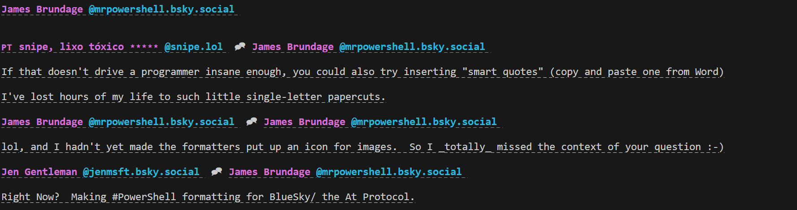

 
<a href='https://github.com/sponsors/StartAutomating'>❤️</a>
<a href='https://github.com/StartAutomating/PSA/stargazers'>⭐</a>

# PowerShell Announcements (with AtProtocol)

PSA is:

* A PowerShell Module For Making Announcements
* A Beautiful BlueSky Client for the CLI
* An (Almost) Perfect PowerShell Wrapper for the At Protocol
* A GitHub Action to Automate Annoucements

## Getting Started

To connect to AtProtocol / BlueSky with PSA, simply use Connect-BlueSky:

~~~PowerShell
$myCredential = Get-Credential # Provide your handle or email and an app-password
Connect-BlueSky -Authentication $myCredential
~~~

## Getting Profiles and Posts

Once you're connected, you can talk to every part of the At Protocol.

In the At Protocol, users are called "Actors", so, to get a profile, we'd use:

~~~PowerShell
Get-BskyActorProfile -Actor mrpowershell.bsky.social
~~~

You'll see a nice snapshot of a profile:

While this might look nice, it's actually a full object.

You can explore what that object can do by piping it to the PowerShell command, Get-Member

~~~PowerShell
Get-BskyActorProfile -Actor mrpowershell.bsky.social -Cache | Get-Member
~~~

For instance, this would show the profile's first 50 posts.

~~~PowerShell
(Get-BskyActorProfile -Actor mrpowershell.bsky.social -Cache).Posts
~~~
 
And this would show the first 50 liked posts.

~~~PowerShell
(Get-BskyActorProfile -Actor mrpowershell.bsky.social -Cache).Likes
~~~

This shows us the first 50 followers

~~~PowerShell
(Get-BskyActorProfile -Actor mrpowershell.bsky.social -Cache).Followers
~~~

This shows us the first 50 follows

~~~PowerShell
(Get-BskyActorProfile -Actor mrpowershell.bsky.social -Cache).Follows
~~~

To get more of any of these results, simply get the .More property

~~~PowerShell
# Get the profile
$BlueSkyProfile = (Get-BskyActorProfile -Actor mrpowershell.bsky.social -Cache)
# Get the first 50 posts
$BlueSkyProfile.Posts
# Get the next 50 posts
$BlueSkyProfile.Posts.More
~~~

## How PSA is Built

PSA is primarily built automatically.

It uses [PipeScript](https://github.com/StartAutomating/PipeScript) to generate PowerShell commands automatically for every lexicon in the At Protocol.

[EZOut](https://github.com/StartAutomating/EZOut) is used to add formatting, so that posts and profiles look nice and can be clicked.

## SendPSA - The GitHub Action

PSA can be used as a GitHub Action!  Just add these few lines to any job:

~~~yaml
- name: Run PSA
  uses: StartAutomating/PSA@main
  id: PSA
~~~

This will import PSA and look thru the workspace for any `*.PSA.ps1` files and run them.

Check out PSA's [PSA Script](https://github.com/StartAutomating/PSA/blob/main/PSA.PSA.ps1) for a useful example.

## PSA Commands

PSA exports 548 commands
(108 functions and 440 aliases)

Functions
=========

|Name                                                                                    |Synopsis                                   |
|----------------------------------------------------------------------------------------|-------------------------------------------|
|[Add-AtprotoModerationReport](Add-AtprotoModerationReport.md)                      |com.atproto.moderation.createReport        |
|[Add-AtprotoRepoRecord](Add-AtprotoRepoRecord.md)                                  |com.atproto.repo.createRecord              |
|[Add-AtProtoServerAccount](Add-AtProtoServerAccount.md)                            |com.atproto.server.createAccount           |
|[Add-AtprotoServerAppPassword](Add-AtprotoServerAppPassword.md)                    |com.atproto.server.createAppPassword       |
|[Add-AtProtoServerInviteCode](Add-AtProtoServerInviteCode.md)                      |com.atproto.server.createInviteCode        |
|[Add-AtProtoServerInviteCodes](Add-AtProtoServerInviteCodes.md)                    |com.atproto.server.createInviteCodes       |
|[Add-AtProtoServerSession](Add-AtProtoServerSession.md)                            |com.atproto.server.createSession           |
|[Block-BskyGraphActor](Block-BskyGraphActor.md)                                    |app.bsky.graph.muteActor                   |
|[Block-BskyGraphActorList](Block-BskyGraphActorList.md)                            |app.bsky.graph.muteActorList               |
|[Connect-AtProto](Connect-AtProto.md)                                              |Connects to the AtProtocol                 |
|[Disable-AtprotoAdminAccountInvites](Disable-AtprotoAdminAccountInvites.md)        |com.atproto.admin.disableAccountInvites    |
|[Disable-AtprotoAdminInviteCodes](Disable-AtprotoAdminInviteCodes.md)              |com.atproto.admin.disableInviteCodes       |
|[Enable-AtProtoAdminAccountInvites](Enable-AtProtoAdminAccountInvites.md)          |com.atproto.admin.enableAccountInvites     |
|[Get-AtprotoAdminDefinition](Get-AtprotoAdminDefinition.md)                        |
|[Get-AtprotoAdminInviteCodes](Get-AtprotoAdminInviteCodes.md)                      |com.atproto.admin.getInviteCodes           |
|[Get-AtProtoAdminModerationAction](Get-AtProtoAdminModerationAction.md)            |com.atproto.admin.getModerationAction      |
|[Get-AtProtoAdminModerationActions](Get-AtProtoAdminModerationActions.md)          |com.atproto.admin.getModerationActions     |
|[Get-AtprotoAdminModerationReport](Get-AtprotoAdminModerationReport.md)            |com.atproto.admin.getModerationReport      |
|[Get-AtProtoAdminModerationReports](Get-AtProtoAdminModerationReports.md)          |com.atproto.admin.getModerationReports     |
|[Get-AtprotoAdminRecord](Get-AtprotoAdminRecord.md)                                |com.atproto.admin.getRecord                |
|[Get-AtprotoAdminRepo](Get-AtprotoAdminRepo.md)                                    |com.atproto.admin.getRepo                  |
|[Get-AtprotoLabelDefinition](Get-AtprotoLabelDefinition.md)                        |
|[Get-AtprotoModerationDefinition](Get-AtprotoModerationDefinition.md)              |
|[Get-AtProtoRepo](Get-AtProtoRepo.md)                                              |com.atproto.repo.describeRepo              |
|[Get-AtProtoRepoRecord](Get-AtProtoRepoRecord.md)                                  |com.atproto.repo.getRecord                 |
|[Get-AtProtoRepoRecords](Get-AtProtoRepoRecords.md)                                |com.atproto.repo.listRecords               |
|[Get-AtProtoServer](Get-AtProtoServer.md)                                          |com.atproto.server.describeServer          |
|[Get-AtprotoServerAccountInviteCodes](Get-AtprotoServerAccountInviteCodes.md)      |com.atproto.server.getAccountInviteCodes   |
|[Get-AtprotoServerAppPasswords](Get-AtprotoServerAppPasswords.md)                  |com.atproto.server.listAppPasswords        |
|[Get-AtprotoServerDefinition](Get-AtprotoServerDefinition.md)                      |
|[Get-AtProtoServerSession](Get-AtProtoServerSession.md)                            |com.atproto.server.getSession              |
|[Get-AtprotoSyncBlob](Get-AtprotoSyncBlob.md)                                      |com.atproto.sync.getBlob                   |
|[Get-AtprotoSyncBlobs](Get-AtprotoSyncBlobs.md)                                    |com.atproto.sync.listBlobs                 |
|[Get-AtProtoSyncBlocks](Get-AtProtoSyncBlocks.md)                                  |com.atproto.sync.getBlocks                 |
|[Get-AtProtoSyncCheckout](Get-AtProtoSyncCheckout.md)                              |com.atproto.sync.getCheckout               |
|[Get-AtprotoSyncHead](Get-AtprotoSyncHead.md)                                      |com.atproto.sync.getHead                   |
|[Get-AtprotoSyncLatestCommit](Get-AtprotoSyncLatestCommit.md)                      |com.atproto.sync.getLatestCommit           |
|[Get-AtprotoSyncRecord](Get-AtprotoSyncRecord.md)                                  |com.atproto.sync.getRecord                 |
|[Get-AtprotoSyncRepo](Get-AtprotoSyncRepo.md)                                      |com.atproto.sync.getRepo                   |
|[Get-AtProtoSyncRepos](Get-AtProtoSyncRepos.md)                                    |com.atproto.sync.listRepos                 |
|[Get-BskyActorDefinition](Get-BskyActorDefinition.md)                              |
|[Get-BskyActorPreferences](Get-BskyActorPreferences.md)                            |app.bsky.actor.getPreferences              |
|[Get-BskyActorProfile](Get-BskyActorProfile.md)                                    |app.bsky.actor.getProfile                  |
|[Get-BskyActorProfiles](Get-BskyActorProfiles.md)                                  |app.bsky.actor.getProfiles                 |
|[Get-BskyActorSuggestions](Get-BskyActorSuggestions.md)                            |app.bsky.actor.getSuggestions              |
|[Get-BskyFeed](Get-BskyFeed.md)                                                    |app.bsky.feed.getFeed                      |
|[Get-BskyFeedActorFeeds](Get-BskyFeedActorFeeds.md)                                |app.bsky.feed.getActorFeeds                |
|[Get-BskyFeedActorLikes](Get-BskyFeedActorLikes.md)                                |app.bsky.feed.getActorLikes                |
|[Get-BskyFeedAuthorFeed](Get-BskyFeedAuthorFeed.md)                                |app.bsky.feed.getAuthorFeed                |
|[Get-BskyFeedDefinition](Get-BskyFeedDefinition.md)                                |
|[Get-BskyFeedGenerator](Get-BskyFeedGenerator.md)                                  |app.bsky.feed.getFeedGenerator             |
|[Get-BskyFeedGenerators](Get-BskyFeedGenerators.md)                                |app.bsky.feed.getFeedGenerators            |
|[Get-BskyFeedLikes](Get-BskyFeedLikes.md)                                          |app.bsky.feed.getLikes                     |
|[Get-BskyFeedPosts](Get-BskyFeedPosts.md)                                          |app.bsky.feed.getPosts                     |
|[Get-BskyFeedPostThread](Get-BskyFeedPostThread.md)                                |app.bsky.feed.getPostThread                |
|[Get-BskyFeedRepostedBy](Get-BskyFeedRepostedBy.md)                                |app.bsky.feed.getRepostedBy                |
|[Get-BskyFeedSkeleton](Get-BskyFeedSkeleton.md)                                    |app.bsky.feed.getFeedSkeleton              |
|[Get-BskyFeedSuggestedFeeds](Get-BskyFeedSuggestedFeeds.md)                        |app.bsky.feed.getSuggestedFeeds            |
|[Get-BskyFeedTimeline](Get-BskyFeedTimeline.md)                                    |app.bsky.feed.getTimeline                  |
|[Get-BskyGraphBlocks](Get-BskyGraphBlocks.md)                                      |app.bsky.graph.getBlocks                   |
|[Get-BskyGraphDefinition](Get-BskyGraphDefinition.md)                              |
|[Get-BskyGraphFollowers](Get-BskyGraphFollowers.md)                                |app.bsky.graph.getFollowers                |
|[Get-BskyGraphFollows](Get-BskyGraphFollows.md)                                    |app.bsky.graph.getFollows                  |
|[Get-BskyGraphList](Get-BskyGraphList.md)                                          |app.bsky.graph.getList                     |
|[Get-BskyGraphListMutes](Get-BskyGraphListMutes.md)                                |app.bsky.graph.getListMutes                |
|[Get-BskyGraphLists](Get-BskyGraphLists.md)                                        |app.bsky.graph.getLists                    |
|[Get-BskyGraphMutes](Get-BskyGraphMutes.md)                                        |app.bsky.graph.getMutes                    |
|[Get-BskyNotifications](Get-BskyNotifications.md)                                  |app.bsky.notification.listNotifications    |
|[Get-BskyNotificationUnreadCount](Get-BskyNotificationUnreadCount.md)              |app.bsky.notification.getUnreadCount       |
|[Get-BskyUnspeccedPopular](Get-BskyUnspeccedPopular.md)                            |app.bsky.unspecced.getPopular              |
|[Get-BskyUnspeccedPopularFeedGenerators](Get-BskyUnspeccedPopularFeedGenerators.md)|app.bsky.unspecced.getPopularFeedGenerators|
|[Get-BskyUnspeccedTimelineSkeleton](Get-BskyUnspeccedTimelineSkeleton.md)          |app.bsky.unspecced.getTimelineSkeleton     |
|[Invoke-AtProto](Invoke-AtProto.md)                                                |Invokes the AT Protocol                    |
|[Invoke-AtprotoAdminModerationAction](Invoke-AtprotoAdminModerationAction.md)      |com.atproto.admin.takeModerationAction     |
|[Register-BskyNotificationPush](Register-BskyNotificationPush.md)                  |app.bsky.notification.registerPush         |
|[Remove-AtprotoRepoRecord](Remove-AtprotoRepoRecord.md)                            |com.atproto.repo.deleteRecord              |
|[Remove-AtprotoServerAccount](Remove-AtprotoServerAccount.md)                      |com.atproto.server.deleteAccount           |
|[Remove-AtProtoServerSession](Remove-AtProtoServerSession.md)                      |com.atproto.server.deleteSession           |
|[Request-AtprotoServerAccountDelete](Request-AtprotoServerAccountDelete.md)        |com.atproto.server.requestAccountDelete    |
|[Request-AtProtoServerPasswordReset](Request-AtProtoServerPasswordReset.md)        |com.atproto.server.requestPasswordReset    |
|[Request-AtprotoSyncCrawl](Request-AtprotoSyncCrawl.md)                            |com.atproto.sync.requestCrawl              |
|[Reset-AtprotoServerPassword](Reset-AtprotoServerPassword.md)                      |com.atproto.server.resetPassword           |
|[Resolve-AtProtoAdminModerationReports](Resolve-AtProtoAdminModerationReports.md)  |com.atproto.admin.resolveModerationReports |
|[Resolve-AtprotoIdentityHandle](Resolve-AtprotoIdentityHandle.md)                  |com.atproto.identity.resolveHandle         |
|[Revoke-AtProtoServerAppPassword](Revoke-AtProtoServerAppPassword.md)              |com.atproto.server.revokeAppPassword       |
|[Search-AtProtoAdminRepos](Search-AtProtoAdminRepos.md)                            |com.atproto.admin.searchRepos              |
|[Search-AtProtoLabels](Search-AtProtoLabels.md)                                    |com.atproto.label.queryLabels              |
|[Search-BskyActors](Search-BskyActors.md)                                          |app.bsky.actor.searchActors                |
|[Search-BskyActorsTypeahead](Search-BskyActorsTypeahead.md)                        |app.bsky.actor.searchActorsTypeahead       |
|[Send-AtProto](Send-AtProto.md)                                                    |Sends to the At Protocol                   |
|[Send-AtProtoAdminEmail](Send-AtProtoAdminEmail.md)                                |com.atproto.admin.sendEmail                |
|[Set-AtProtoRepoBlob](Set-AtProtoRepoBlob.md)                                      |com.atproto.repo.uploadBlob                |
|[Set-AtProtoRepoRecord](Set-AtProtoRepoRecord.md)                                  |com.atproto.repo.putRecord                 |
|[Set-AtProtoRepoWrites](Set-AtProtoRepoWrites.md)                                  |com.atproto.repo.applyWrites               |
|[Set-BskyActorPreferences](Set-BskyActorPreferences.md)                            |app.bsky.actor.putPreferences              |
|[Set-BskyUnspeccedLabels](Set-BskyUnspeccedLabels.md)                              |app.bsky.unspecced.applyLabels             |
|[Sync-AtProtoServerSession](Sync-AtProtoServerSession.md)                          |com.atproto.server.refreshSession          |
|[Unblock-BskyGraphActor](Unblock-BskyGraphActor.md)                                |app.bsky.graph.unmuteActor                 |
|[Unblock-BskyGraphActorList](Unblock-BskyGraphActorList.md)                        |app.bsky.graph.unmuteActorList             |
|[Undo-AtProtoAdminModerationAction](Undo-AtProtoAdminModerationAction.md)          |com.atproto.admin.reverseModerationAction  |
|[Update-AtprotoAdminAccountEmail](Update-AtprotoAdminAccountEmail.md)              |com.atproto.admin.updateAccountEmail       |
|[Update-AtProtoAdminAccountHandle](Update-AtProtoAdminAccountHandle.md)            |com.atproto.admin.updateAccountHandle      |
|[Update-AtProtoIdentityHandle](Update-AtProtoIdentityHandle.md)                    |com.atproto.identity.updateHandle          |
|[Update-AtprotoTempRepoVersion](Update-AtprotoTempRepoVersion.md)                  |com.atproto.temp.upgradeRepoVersion        |
|[Update-BskyNotificationSeen](Update-BskyNotificationSeen.md)                      |app.bsky.notification.updateSeen           |
|[Watch-AtprotoLabels](Watch-AtprotoLabels.md)                                      |com.atproto.label.subscribeLabels          |
|[Watch-AtprotoSyncRepos](Watch-AtprotoSyncRepos.md)                                |com.atproto.sync.subscribeRepos            |
|[Watch-AtProtoSyncUpdate](Watch-AtProtoSyncUpdate.md)                              |com.atproto.sync.notifyOfUpdate            |

Aliases
=======

|Name                                                                                    |ResolvedCommand|
|----------------------------------------------------------------------------------------|---------------|
|[Add-AtprotoModerationReport](Add-AtprotoModerationReport.md)                      |
|[Add-AtprotoRepoRecord](Add-AtprotoRepoRecord.md)                                  |
|[Add-AtProtoServerAccount](Add-AtProtoServerAccount.md)                            |
|[Add-AtprotoServerAppPassword](Add-AtprotoServerAppPassword.md)                    |
|[Add-AtProtoServerInviteCode](Add-AtProtoServerInviteCode.md)                      |
|[Add-AtProtoServerInviteCodes](Add-AtProtoServerInviteCodes.md)                    |
|[Add-AtProtoServerSession](Add-AtProtoServerSession.md)                            |
|[Block-BskyGraphActor](Block-BskyGraphActor.md)                                    |
|[Block-BskyGraphActorList](Block-BskyGraphActorList.md)                            |
|[Connect-AtProto](Connect-AtProto.md)                                              |
|[Disable-AtprotoAdminAccountInvites](Disable-AtprotoAdminAccountInvites.md)        |
|[Disable-AtprotoAdminInviteCodes](Disable-AtprotoAdminInviteCodes.md)              |
|[Enable-AtProtoAdminAccountInvites](Enable-AtProtoAdminAccountInvites.md)          |
|[Get-AtprotoAdminDefinition](Get-AtprotoAdminDefinition.md)                        |
|[Get-AtprotoAdminInviteCodes](Get-AtprotoAdminInviteCodes.md)                      |
|[Get-AtProtoAdminModerationAction](Get-AtProtoAdminModerationAction.md)            |
|[Get-AtProtoAdminModerationActions](Get-AtProtoAdminModerationActions.md)          |
|[Get-AtprotoAdminModerationReport](Get-AtprotoAdminModerationReport.md)            |
|[Get-AtProtoAdminModerationReports](Get-AtProtoAdminModerationReports.md)          |
|[Get-AtprotoAdminRecord](Get-AtprotoAdminRecord.md)                                |
|[Get-AtprotoAdminRepo](Get-AtprotoAdminRepo.md)                                    |
|[Get-AtprotoLabelDefinition](Get-AtprotoLabelDefinition.md)                        |
|[Get-AtprotoModerationDefinition](Get-AtprotoModerationDefinition.md)              |
|[Get-AtProtoRepo](Get-AtProtoRepo.md)                                              |
|[Get-AtProtoRepoRecord](Get-AtProtoRepoRecord.md)                                  |
|[Get-AtProtoRepoRecords](Get-AtProtoRepoRecords.md)                                |
|[Get-AtProtoServer](Get-AtProtoServer.md)                                          |
|[Get-AtprotoServerAccountInviteCodes](Get-AtprotoServerAccountInviteCodes.md)      |
|[Get-AtprotoServerAppPasswords](Get-AtprotoServerAppPasswords.md)                  |
|[Get-AtprotoServerDefinition](Get-AtprotoServerDefinition.md)                      |
|[Get-AtProtoServerSession](Get-AtProtoServerSession.md)                            |
|[Get-AtprotoSyncBlob](Get-AtprotoSyncBlob.md)                                      |
|[Get-AtprotoSyncBlobs](Get-AtprotoSyncBlobs.md)                                    |
|[Get-AtProtoSyncBlocks](Get-AtProtoSyncBlocks.md)                                  |
|[Get-AtProtoSyncCheckout](Get-AtProtoSyncCheckout.md)                              |
|[Get-AtprotoSyncHead](Get-AtprotoSyncHead.md)                                      |
|[Get-AtprotoSyncLatestCommit](Get-AtprotoSyncLatestCommit.md)                      |
|[Get-AtprotoSyncRecord](Get-AtprotoSyncRecord.md)                                  |
|[Get-AtprotoSyncRepo](Get-AtprotoSyncRepo.md)                                      |
|[Get-AtProtoSyncRepos](Get-AtProtoSyncRepos.md)                                    |
|[Get-BskyActorDefinition](Get-BskyActorDefinition.md)                              |
|[Get-BskyActorPreferences](Get-BskyActorPreferences.md)                            |
|[Get-BskyActorProfile](Get-BskyActorProfile.md)                                    |
|[Get-BskyActorProfiles](Get-BskyActorProfiles.md)                                  |
|[Get-BskyActorSuggestions](Get-BskyActorSuggestions.md)                            |
|[Get-BskyFeed](Get-BskyFeed.md)                                                    |
|[Get-BskyFeedActorFeeds](Get-BskyFeedActorFeeds.md)                                |
|[Get-BskyFeedActorLikes](Get-BskyFeedActorLikes.md)                                |
|[Get-BskyFeedAuthorFeed](Get-BskyFeedAuthorFeed.md)                                |
|[Get-BskyFeedDefinition](Get-BskyFeedDefinition.md)                                |
|[Get-BskyFeedGenerator](Get-BskyFeedGenerator.md)                                  |
|[Get-BskyFeedGenerators](Get-BskyFeedGenerators.md)                                |
|[Get-BskyFeedLikes](Get-BskyFeedLikes.md)                                          |
|[Get-BskyFeedPosts](Get-BskyFeedPosts.md)                                          |
|[Get-BskyFeedPostThread](Get-BskyFeedPostThread.md)                                |
|[Get-BskyFeedRepostedBy](Get-BskyFeedRepostedBy.md)                                |
|[Get-BskyFeedSkeleton](Get-BskyFeedSkeleton.md)                                    |
|[Get-BskyFeedSuggestedFeeds](Get-BskyFeedSuggestedFeeds.md)                        |
|[Get-BskyFeedTimeline](Get-BskyFeedTimeline.md)                                    |
|[Get-BskyGraphBlocks](Get-BskyGraphBlocks.md)                                      |
|[Get-BskyGraphDefinition](Get-BskyGraphDefinition.md)                              |
|[Get-BskyGraphFollowers](Get-BskyGraphFollowers.md)                                |
|[Get-BskyGraphFollows](Get-BskyGraphFollows.md)                                    |
|[Get-BskyGraphList](Get-BskyGraphList.md)                                          |
|[Get-BskyGraphListMutes](Get-BskyGraphListMutes.md)                                |
|[Get-BskyGraphLists](Get-BskyGraphLists.md)                                        |
|[Get-BskyGraphMutes](Get-BskyGraphMutes.md)                                        |
|[Get-BskyNotifications](Get-BskyNotifications.md)                                  |
|[Get-BskyNotificationUnreadCount](Get-BskyNotificationUnreadCount.md)              |
|[Get-BskyUnspeccedPopular](Get-BskyUnspeccedPopular.md)                            |
|[Get-BskyUnspeccedPopularFeedGenerators](Get-BskyUnspeccedPopularFeedGenerators.md)|
|[Get-BskyUnspeccedTimelineSkeleton](Get-BskyUnspeccedTimelineSkeleton.md)          |
|[Invoke-AtProto](Invoke-AtProto.md)                                                |
|[Invoke-AtprotoAdminModerationAction](Invoke-AtprotoAdminModerationAction.md)      |
|[Register-BskyNotificationPush](Register-BskyNotificationPush.md)                  |
|[Remove-AtprotoRepoRecord](Remove-AtprotoRepoRecord.md)                            |
|[Remove-AtprotoServerAccount](Remove-AtprotoServerAccount.md)                      |
|[Remove-AtProtoServerSession](Remove-AtProtoServerSession.md)                      |
|[Request-AtprotoServerAccountDelete](Request-AtprotoServerAccountDelete.md)        |
|[Request-AtProtoServerPasswordReset](Request-AtProtoServerPasswordReset.md)        |
|[Request-AtprotoSyncCrawl](Request-AtprotoSyncCrawl.md)                            |
|[Reset-AtprotoServerPassword](Reset-AtprotoServerPassword.md)                      |
|[Resolve-AtProtoAdminModerationReports](Resolve-AtProtoAdminModerationReports.md)  |
|[Resolve-AtprotoIdentityHandle](Resolve-AtprotoIdentityHandle.md)                  |
|[Revoke-AtProtoServerAppPassword](Revoke-AtProtoServerAppPassword.md)              |
|[Search-AtProtoAdminRepos](Search-AtProtoAdminRepos.md)                            |
|[Search-AtProtoLabels](Search-AtProtoLabels.md)                                    |
|[Search-BskyActors](Search-BskyActors.md)                                          |
|[Search-BskyActorsTypeahead](Search-BskyActorsTypeahead.md)                        |
|[Send-AtProto](Send-AtProto.md)                                                    |
|[Send-AtProtoAdminEmail](Send-AtProtoAdminEmail.md)                                |
|[Set-AtProtoRepoBlob](Set-AtProtoRepoBlob.md)                                      |
|[Set-AtProtoRepoRecord](Set-AtProtoRepoRecord.md)                                  |
|[Set-AtProtoRepoWrites](Set-AtProtoRepoWrites.md)                                  |
|[Set-BskyActorPreferences](Set-BskyActorPreferences.md)                            |
|[Set-BskyUnspeccedLabels](Set-BskyUnspeccedLabels.md)                              |
|[Sync-AtProtoServerSession](Sync-AtProtoServerSession.md)                          |
|[Unblock-BskyGraphActor](Unblock-BskyGraphActor.md)                                |
|[Unblock-BskyGraphActorList](Unblock-BskyGraphActorList.md)                        |
|[Undo-AtProtoAdminModerationAction](Undo-AtProtoAdminModerationAction.md)          |
|[Update-AtprotoAdminAccountEmail](Update-AtprotoAdminAccountEmail.md)              |
|[Update-AtProtoAdminAccountHandle](Update-AtProtoAdminAccountHandle.md)            |
|[Update-AtProtoIdentityHandle](Update-AtProtoIdentityHandle.md)                    |
|[Update-AtprotoTempRepoVersion](Update-AtprotoTempRepoVersion.md)                  |
|[Update-BskyNotificationSeen](Update-BskyNotificationSeen.md)                      |
|[Watch-AtprotoLabels](Watch-AtprotoLabels.md)                                      |
|[Watch-AtprotoSyncRepos](Watch-AtprotoSyncRepos.md)                                |
|[Watch-AtProtoSyncUpdate](Watch-AtProtoSyncUpdate.md)                              |
