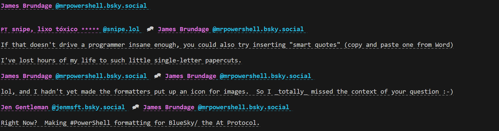

 
<a href='https://github.com/sponsors/StartAutomating'>❤️</a>
<a href='https://github.com/StartAutomating/PSA/stargazers'>⭐</a>

# PowerShell Announcements (with AtProtocol)

PSA is:

* A PowerShell Module For Making Announcements
* A Beautiful BlueSky Client for the CLI
* An (Almost) Perfect PowerShell Wrapper for the At Protocol
* A GitHub Action to Automate Announcements

## Getting Started

To connect to AtProtocol / BlueSky with PSA, simply use Connect-BlueSky:

~~~PowerShell
$myCredential = Get-Credential # Provide your handle or email and an app-password
Connect-BlueSky -Authentication $myCredential
~~~

## Getting Profiles and Posts

Once you're connected, you can talk to every part of the At Protocol.

In the At Protocol, users are called "Actors", so, to get a profile, we'd use:

~~~PowerShell
Get-BskyActorProfile -Actor mrpowershell.bsky.social
~~~

You'll see a nice snapshot of a profile:

While this might look nice, it's actually a full object.

You can explore what that object can do by piping it to the PowerShell command, Get-Member

~~~PowerShell
Get-BskyActorProfile -Actor mrpowershell.bsky.social -Cache | Get-Member
~~~

For instance, this would show the profile's first 50 posts.

~~~PowerShell
(Get-BskyActorProfile -Actor mrpowershell.bsky.social -Cache).Posts
~~~
 
And this would show the first 50 liked posts.

~~~PowerShell
(Get-BskyActorProfile -Actor mrpowershell.bsky.social -Cache).Likes
~~~

This shows us the first 50 followers

~~~PowerShell
(Get-BskyActorProfile -Actor mrpowershell.bsky.social -Cache).Followers
~~~

This shows us the first 50 follows

~~~PowerShell
(Get-BskyActorProfile -Actor mrpowershell.bsky.social -Cache).Follows
~~~

To get more of any of these results, simply get the .More property

~~~PowerShell
# Get the profile
$BlueSkyProfile = (Get-BskyActorProfile -Actor mrpowershell.bsky.social -Cache)
# Get the first 50 posts
$BlueSkyProfile.Posts
# Get the next 50 posts
$BlueSkyProfile.Posts.More
~~~

## How PSA is Built

PSA is primarily built automatically.

It uses [PipeScript](https://github.com/StartAutomating/PipeScript) to generate PowerShell commands automatically for every lexicon in the At Protocol.

[EZOut](https://github.com/StartAutomating/EZOut) is used to add formatting, so that posts and profiles look nice and can be clicked.

## SendPSA - The GitHub Action

PSA can be used as a GitHub Action!  Just add these few lines to any job:

~~~yaml
- name: Run PSA
  uses: StartAutomating/PSA@main
  id: PSA
~~~

This will import PSA and look thru the workspace for any `*.PSA.ps1` files and run them.

Check out PSA's [PSA Script](https://github.com/StartAutomating/PSA/blob/main/PSA.PSA.ps1) for a useful example.

## PSA Commands

PSA exports 915 commands
(199 functions and 716 aliases)

Functions
=========

|Name                                                                                                |Synopsis                                         |
|----------------------------------------------------------------------------------------------------|-------------------------------------------------|
|[Add-AtProtoModerationReport](Add-AtProtoModerationReport.md)                                  |com.atproto.moderation.createReport              |
|[Add-AtProtoRepoRecord](Add-AtProtoRepoRecord.md)                                              |com.atproto.repo.createRecord                    |
|[Add-AtProtoServerAccount](Add-AtProtoServerAccount.md)                                        |com.atproto.server.createAccount                 |
|[Add-AtProtoServerAppPassword](Add-AtProtoServerAppPassword.md)                                |com.atproto.server.createAppPassword             |
|[Add-AtProtoServerInviteCode](Add-AtProtoServerInviteCode.md)                                  |com.atproto.server.createInviteCode              |
|[Add-AtProtoServerInviteCodes](Add-AtProtoServerInviteCodes.md)                                |com.atproto.server.createInviteCodes             |
|[Add-AtProtoServerSession](Add-AtProtoServerSession.md)                                        |com.atproto.server.createSession                 |
|[Add-OzoneCommunicationTemplate](Add-OzoneCommunicationTemplate.md)                            |tools.ozone.communication.createTemplate         |
|[Block-BskyConvo](Block-BskyConvo.md)                                                          |chat.bsky.convo.muteConvo                        |
|[Block-BskyGraphActor](Block-BskyGraphActor.md)                                                |app.bsky.graph.muteActor                         |
|[Block-BskyGraphActorList](Block-BskyGraphActorList.md)                                        |app.bsky.graph.muteActorList                     |
|[Block-BskyGraphThread](Block-BskyGraphThread.md)                                              |app.bsky.graph.muteThread                        |
|[Connect-AtProto](Connect-AtProto.md)                                                          |Connects to the AtProtocol                       |
|[Disable-AtProtoAdminAccountInvites](Disable-AtProtoAdminAccountInvites.md)                    |com.atproto.admin.disableAccountInvites          |
|[Disable-AtProtoAdminInviteCodes](Disable-AtProtoAdminInviteCodes.md)                          |com.atproto.admin.disableInviteCodes             |
|[Enable-AtProtoAdminAccountInvites](Enable-AtProtoAdminAccountInvites.md)                      |com.atproto.admin.enableAccountInvites           |
|[Get-AtProtoAdminAccountInfo](Get-AtProtoAdminAccountInfo.md)                                  |com.atproto.admin.getAccountInfo                 |
|[Get-AtProtoAdminAccountInfos](Get-AtProtoAdminAccountInfos.md)                                |com.atproto.admin.getAccountInfos                |
|[Get-AtProtoAdminDefinition](Get-AtProtoAdminDefinition.md)                                    |
|[Get-AtProtoAdminInviteCodes](Get-AtProtoAdminInviteCodes.md)                                  |com.atproto.admin.getInviteCodes                 |
|[Get-AtProtoAdminModerationAction](Get-AtProtoAdminModerationAction.md)                        |com.atproto.admin.getModerationAction            |
|[Get-AtProtoAdminModerationActions](Get-AtProtoAdminModerationActions.md)                      |com.atproto.admin.getModerationActions           |
|[Get-AtProtoAdminModerationReport](Get-AtProtoAdminModerationReport.md)                        |com.atproto.admin.getModerationReport            |
|[Get-AtProtoAdminModerationReports](Get-AtProtoAdminModerationReports.md)                      |com.atproto.admin.getModerationReports           |
|[Get-AtProtoAdminRecord](Get-AtProtoAdminRecord.md)                                            |com.atproto.admin.getRecord                      |
|[Get-AtProtoAdminRepo](Get-AtProtoAdminRepo.md)                                                |com.atproto.admin.getRepo                        |
|[Get-AtProtoAdminSubjectStatus](Get-AtProtoAdminSubjectStatus.md)                              |com.atproto.admin.getSubjectStatus               |
|[Get-AtProtoIdentityRecommendedDidCredentials](Get-AtProtoIdentityRecommendedDidCredentials.md)|com.atproto.identity.getRecommendedDidCredentials|
|[Get-AtProtoLabelDefinition](Get-AtProtoLabelDefinition.md)                                    |
|[Get-AtProtoModerationDefinition](Get-AtProtoModerationDefinition.md)                          |
|[Get-AtProtoRepo](Get-AtProtoRepo.md)                                                          |com.atproto.repo.describeRepo                    |
|[Get-AtProtoRepoDefinition](Get-AtProtoRepoDefinition.md)                                      |
|[Get-AtProtoRepoMissingBlobs](Get-AtProtoRepoMissingBlobs.md)                                  |com.atproto.repo.listMissingBlobs                |
|[Get-AtProtoRepoRecord](Get-AtProtoRepoRecord.md)                                              |com.atproto.repo.getRecord                       |
|[Get-AtProtoRepoRecords](Get-AtProtoRepoRecords.md)                                            |com.atproto.repo.listRecords                     |
|[Get-AtProtoServer](Get-AtProtoServer.md)                                                      |com.atproto.server.describeServer                |
|[Get-AtProtoServerAccountInviteCodes](Get-AtProtoServerAccountInviteCodes.md)                  |com.atproto.server.getAccountInviteCodes         |
|[Get-AtProtoServerAppPasswords](Get-AtProtoServerAppPasswords.md)                              |com.atproto.server.listAppPasswords              |
|[Get-AtProtoServerDefinition](Get-AtProtoServerDefinition.md)                                  |
|[Get-AtProtoServerServiceAuth](Get-AtProtoServerServiceAuth.md)                                |com.atproto.server.getServiceAuth                |
|[Get-AtProtoServerSession](Get-AtProtoServerSession.md)                                        |com.atproto.server.getSession                    |
|[Get-AtProtoSyncBlob](Get-AtProtoSyncBlob.md)                                                  |com.atproto.sync.getBlob                         |
|[Get-AtProtoSyncBlobs](Get-AtProtoSyncBlobs.md)                                                |com.atproto.sync.listBlobs                       |
|[Get-AtProtoSyncBlocks](Get-AtProtoSyncBlocks.md)                                              |com.atproto.sync.getBlocks                       |
|[Get-AtProtoSyncCheckout](Get-AtProtoSyncCheckout.md)                                          |com.atproto.sync.getCheckout                     |
|[Get-AtProtoSyncHead](Get-AtProtoSyncHead.md)                                                  |com.atproto.sync.getHead                         |
|[Get-AtProtoSyncLatestCommit](Get-AtProtoSyncLatestCommit.md)                                  |com.atproto.sync.getLatestCommit                 |
|[Get-AtProtoSyncRecord](Get-AtProtoSyncRecord.md)                                              |com.atproto.sync.getRecord                       |
|[Get-AtProtoSyncRepo](Get-AtProtoSyncRepo.md)                                                  |com.atproto.sync.getRepo                         |
|[Get-AtProtoSyncRepos](Get-AtProtoSyncRepos.md)                                                |com.atproto.sync.listRepos                       |
|[Get-AtProtoSyncRepoStatus](Get-AtProtoSyncRepoStatus.md)                                      |com.atproto.sync.getRepoStatus                   |
|[Get-BskyActorDefinition](Get-BskyActorDefinition.md)                                          |
|[Get-BskyActorPreferences](Get-BskyActorPreferences.md)                                        |app.bsky.actor.getPreferences                    |
|[Get-BskyActorProfile](Get-BskyActorProfile.md)                                                |app.bsky.actor.getProfile                        |
|[Get-BskyActorProfiles](Get-BskyActorProfiles.md)                                              |app.bsky.actor.getProfiles                       |
|[Get-BskyActorSuggestions](Get-BskyActorSuggestions.md)                                        |app.bsky.actor.getSuggestions                    |
|[Get-BskyConvo](Get-BskyConvo.md)                                                              |chat.bsky.convo.getConvo                         |
|[Get-BskyConvoDefinition](Get-BskyConvoDefinition.md)                                          |
|[Get-BskyConvoForMembers](Get-BskyConvoForMembers.md)                                          |chat.bsky.convo.getConvoForMembers               |
|[Get-BskyConvoLog](Get-BskyConvoLog.md)                                                        |chat.bsky.convo.getLog                           |
|[Get-BskyConvoMessages](Get-BskyConvoMessages.md)                                              |chat.bsky.convo.getMessages                      |
|[Get-BskyConvos](Get-BskyConvos.md)                                                            |chat.bsky.convo.listConvos                       |
|[Get-BskyEmbedDefinition](Get-BskyEmbedDefinition.md)                                          |
|[Get-BskyFeed](Get-BskyFeed.md)                                                                |app.bsky.feed.getFeed                            |
|[Get-BskyFeedActorFeeds](Get-BskyFeedActorFeeds.md)                                            |app.bsky.feed.getActorFeeds                      |
|[Get-BskyFeedActorLikes](Get-BskyFeedActorLikes.md)                                            |app.bsky.feed.getActorLikes                      |
|[Get-BskyFeedAuthorFeed](Get-BskyFeedAuthorFeed.md)                                            |app.bsky.feed.getAuthorFeed                      |
|[Get-BskyFeedDefinition](Get-BskyFeedDefinition.md)                                            |
|[Get-BskyFeedGenerator](Get-BskyFeedGenerator.md)                                              |app.bsky.feed.getFeedGenerator                   |
|[Get-BskyFeedGenerators](Get-BskyFeedGenerators.md)                                            |app.bsky.feed.getFeedGenerators                  |
|[Get-BskyFeedLikes](Get-BskyFeedLikes.md)                                                      |app.bsky.feed.getLikes                           |
|[Get-BskyFeedListFeed](Get-BskyFeedListFeed.md)                                                |app.bsky.feed.getListFeed                        |
|[Get-BskyFeedPosts](Get-BskyFeedPosts.md)                                                      |app.bsky.feed.getPosts                           |
|[Get-BskyFeedPostThread](Get-BskyFeedPostThread.md)                                            |app.bsky.feed.getPostThread                      |
|[Get-BskyFeedQuotes](Get-BskyFeedQuotes.md)                                                    |app.bsky.feed.getQuotes                          |
|[Get-BskyFeedRepostedBy](Get-BskyFeedRepostedBy.md)                                            |app.bsky.feed.getRepostedBy                      |
|[Get-BskyFeedSkeleton](Get-BskyFeedSkeleton.md)                                                |app.bsky.feed.getFeedSkeleton                    |
|[Get-BskyFeedSuggestedFeeds](Get-BskyFeedSuggestedFeeds.md)                                    |app.bsky.feed.getSuggestedFeeds                  |
|[Get-BskyFeedTimeline](Get-BskyFeedTimeline.md)                                                |app.bsky.feed.getTimeline                        |
|[Get-BskyGraphActorStarterPacks](Get-BskyGraphActorStarterPacks.md)                            |app.bsky.graph.getActorStarterPacks              |
|[Get-BskyGraphBlocks](Get-BskyGraphBlocks.md)                                                  |app.bsky.graph.getBlocks                         |
|[Get-BskyGraphDefinition](Get-BskyGraphDefinition.md)                                          |
|[Get-BskyGraphFollowers](Get-BskyGraphFollowers.md)                                            |app.bsky.graph.getFollowers                      |
|[Get-BskyGraphFollows](Get-BskyGraphFollows.md)                                                |app.bsky.graph.getFollows                        |
|[Get-BskyGraphKnownFollowers](Get-BskyGraphKnownFollowers.md)                                  |app.bsky.graph.getKnownFollowers                 |
|[Get-BskyGraphList](Get-BskyGraphList.md)                                                      |app.bsky.graph.getList                           |
|[Get-BskyGraphListBlocks](Get-BskyGraphListBlocks.md)                                          |app.bsky.graph.getListBlocks                     |
|[Get-BskyGraphListMutes](Get-BskyGraphListMutes.md)                                            |app.bsky.graph.getListMutes                      |
|[Get-BskyGraphLists](Get-BskyGraphLists.md)                                                    |app.bsky.graph.getLists                          |
|[Get-BskyGraphMutes](Get-BskyGraphMutes.md)                                                    |app.bsky.graph.getMutes                          |
|[Get-BskyGraphRelationships](Get-BskyGraphRelationships.md)                                    |app.bsky.graph.getRelationships                  |
|[Get-BskyGraphStarterPack](Get-BskyGraphStarterPack.md)                                        |app.bsky.graph.getStarterPack                    |
|[Get-BskyGraphStarterPacks](Get-BskyGraphStarterPacks.md)                                      |app.bsky.graph.getStarterPacks                   |
|[Get-BskyGraphSuggestedFollowsByActor](Get-BskyGraphSuggestedFollowsByActor.md)                |app.bsky.graph.getSuggestedFollowsByActor        |
|[Get-BskyLabelerDefinition](Get-BskyLabelerDefinition.md)                                      |
|[Get-BskyLabelerServices](Get-BskyLabelerServices.md)                                          |app.bsky.labeler.getServices                     |
|[Get-BskyModerationActorMetadata](Get-BskyModerationActorMetadata.md)                          |chat.bsky.moderation.getActorMetadata            |
|[Get-BskyModerationMessageContext](Get-BskyModerationMessageContext.md)                        |chat.bsky.moderation.getMessageContext           |
|[Get-BskyNotifications](Get-BskyNotifications.md)                                              |app.bsky.notification.listNotifications          |
|[Get-BskyNotificationUnreadCount](Get-BskyNotificationUnreadCount.md)                          |app.bsky.notification.getUnreadCount             |
|[Get-BskyUnspeccedConfig](Get-BskyUnspeccedConfig.md)                                          |app.bsky.unspecced.getConfig                     |
|[Get-BskyUnspeccedDefinition](Get-BskyUnspeccedDefinition.md)                                  |
|[Get-BskyUnspeccedPopular](Get-BskyUnspeccedPopular.md)                                        |app.bsky.unspecced.getPopular                    |
|[Get-BskyUnspeccedPopularFeedGenerators](Get-BskyUnspeccedPopularFeedGenerators.md)            |app.bsky.unspecced.getPopularFeedGenerators      |
|[Get-BskyUnspeccedSuggestionsSkeleton](Get-BskyUnspeccedSuggestionsSkeleton.md)                |app.bsky.unspecced.getSuggestionsSkeleton        |
|[Get-BskyUnspeccedTaggedSuggestions](Get-BskyUnspeccedTaggedSuggestions.md)                    |app.bsky.unspecced.getTaggedSuggestions          |
|[Get-BskyUnspeccedTimelineSkeleton](Get-BskyUnspeccedTimelineSkeleton.md)                      |app.bsky.unspecced.getTimelineSkeleton           |
|[Get-BskyUnspeccedTrendingTopics](Get-BskyUnspeccedTrendingTopics.md)                          |app.bsky.unspecced.getTrendingTopics             |
|[Get-BskyVideoDefinition](Get-BskyVideoDefinition.md)                                          |
|[Get-BskyVideoJobStatus](Get-BskyVideoJobStatus.md)                                            |app.bsky.video.getJobStatus                      |
|[Get-BskyVideoUploadLimits](Get-BskyVideoUploadLimits.md)                                      |app.bsky.video.getUploadLimits                   |
|[Get-OzoneCommunicationDefinition](Get-OzoneCommunicationDefinition.md)                        |
|[Get-OzoneCommunicationTemplates](Get-OzoneCommunicationTemplates.md)                          |tools.ozone.communication.listTemplates          |
|[Get-OzoneModerationDefinition](Get-OzoneModerationDefinition.md)                              |
|[Get-OzoneModerationEvent](Get-OzoneModerationEvent.md)                                        |tools.ozone.moderation.getEvent                  |
|[Get-OzoneModerationRecord](Get-OzoneModerationRecord.md)                                      |tools.ozone.moderation.getRecord                 |
|[Get-OzoneModerationRecords](Get-OzoneModerationRecords.md)                                    |tools.ozone.moderation.getRecords                |
|[Get-OzoneModerationRepo](Get-OzoneModerationRepo.md)                                          |tools.ozone.moderation.getRepo                   |
|[Get-OzoneModerationRepos](Get-OzoneModerationRepos.md)                                        |tools.ozone.moderation.getRepos                  |
|[Get-OzoneServerConfig](Get-OzoneServerConfig.md)                                              |tools.ozone.server.getConfig                     |
|[Get-OzoneSetDefinition](Get-OzoneSetDefinition.md)                                            |
|[Get-OzoneSettingDefinition](Get-OzoneSettingDefinition.md)                                    |
|[Get-OzoneSettingOptions](Get-OzoneSettingOptions.md)                                          |tools.ozone.setting.listOptions                  |
|[Get-OzoneSetValues](Get-OzoneSetValues.md)                                                    |tools.ozone.set.getValues                        |
|[Get-OzoneSignatureDefinition](Get-OzoneSignatureDefinition.md)                                |
|[Get-OzoneTeamDefinition](Get-OzoneTeamDefinition.md)                                          |
|[Get-OzoneTeamMembers](Get-OzoneTeamMembers.md)                                                |tools.ozone.team.listMembers                     |
|[Invoke-AtProto](Invoke-AtProto.md)                                                            |Invokes the AT Protocol                          |
|[Invoke-AtProtoAdminModerationAction](Invoke-AtProtoAdminModerationAction.md)                  |com.atproto.admin.takeModerationAction           |
|[Register-BskyNotificationPush](Register-BskyNotificationPush.md)                              |app.bsky.notification.registerPush               |
|[Remove-AtProtoAdminAccount](Remove-AtProtoAdminAccount.md)                                    |com.atproto.admin.deleteAccount                  |
|[Remove-AtProtoRepoRecord](Remove-AtProtoRepoRecord.md)                                        |com.atproto.repo.deleteRecord                    |
|[Remove-AtProtoServerAccount](Remove-AtProtoServerAccount.md)                                  |com.atproto.server.deleteAccount                 |
|[Remove-AtProtoServerSession](Remove-AtProtoServerSession.md)                                  |com.atproto.server.deleteSession                 |
|[Remove-BskyActorAccount](Remove-BskyActorAccount.md)                                          |chat.bsky.actor.deleteAccount                    |
|[Remove-BskyConvoMessageForSelf](Remove-BskyConvoMessageForSelf.md)                            |chat.bsky.convo.deleteMessageForSelf             |
|[Remove-OzoneCommunicationTemplate](Remove-OzoneCommunicationTemplate.md)                      |tools.ozone.communication.deleteTemplate         |
|[Remove-OzoneSet](Remove-OzoneSet.md)                                                          |tools.ozone.set.deleteSet                        |
|[Remove-OzoneSetValues](Remove-OzoneSetValues.md)                                              |tools.ozone.set.deleteValues                     |
|[Remove-OzoneTeamMember](Remove-OzoneTeamMember.md)                                            |tools.ozone.team.deleteMember                    |
|[Request-AtProtoIdentityPlcOperationSignature](Request-AtProtoIdentityPlcOperationSignature.md)|com.atproto.identity.requestPlcOperationSignature|
|[Request-AtProtoServerAccountDelete](Request-AtProtoServerAccountDelete.md)                    |com.atproto.server.requestAccountDelete          |
|[Request-AtProtoServerEmailConfirmation](Request-AtProtoServerEmailConfirmation.md)            |com.atproto.server.requestEmailConfirmation      |
|[Request-AtProtoServerEmailUpdate](Request-AtProtoServerEmailUpdate.md)                        |com.atproto.server.requestEmailUpdate            |
|[Request-AtProtoServerPasswordReset](Request-AtProtoServerPasswordReset.md)                    |com.atproto.server.requestPasswordReset          |
|[Request-AtProtoSyncCrawl](Request-AtProtoSyncCrawl.md)                                        |com.atproto.sync.requestCrawl                    |
|[Request-AtProtoTempPhoneVerification](Request-AtProtoTempPhoneVerification.md)                |com.atproto.temp.requestPhoneVerification        |
|[Reset-AtProtoServerPassword](Reset-AtProtoServerPassword.md)                                  |com.atproto.server.resetPassword                 |
|[Resolve-AtProtoAdminModerationReports](Resolve-AtProtoAdminModerationReports.md)              |com.atproto.admin.resolveModerationReports       |
|[Resolve-AtProtoIdentityHandle](Resolve-AtProtoIdentityHandle.md)                              |com.atproto.identity.resolveHandle               |
|[Revoke-AtProtoServerAppPassword](Revoke-AtProtoServerAppPassword.md)                          |com.atproto.server.revokeAppPassword             |
|[Search-AtProtoAdminAccounts](Search-AtProtoAdminAccounts.md)                                  |com.atproto.admin.searchAccounts                 |
|[Search-AtProtoAdminRepos](Search-AtProtoAdminRepos.md)                                        |com.atproto.admin.searchRepos                    |
|[Search-AtProtoLabels](Search-AtProtoLabels.md)                                                |com.atproto.label.queryLabels                    |
|[Search-BskyActors](Search-BskyActors.md)                                                      |app.bsky.actor.searchActors                      |
|[Search-BskyActorsTypeahead](Search-BskyActorsTypeahead.md)                                    |app.bsky.actor.searchActorsTypeahead             |
|[Search-BskyFeedPosts](Search-BskyFeedPosts.md)                                                |app.bsky.feed.searchPosts                        |
|[Search-BskyGraphStarterPacks](Search-BskyGraphStarterPacks.md)                                |app.bsky.graph.searchStarterPacks                |
|[Search-BskyUnspeccedActorsSkeleton](Search-BskyUnspeccedActorsSkeleton.md)                    |app.bsky.unspecced.searchActorsSkeleton          |
|[Search-BskyUnspeccedPostsSkeleton](Search-BskyUnspeccedPostsSkeleton.md)                      |app.bsky.unspecced.searchPostsSkeleton           |
|[Search-BskyUnspeccedStarterPacksSkeleton](Search-BskyUnspeccedStarterPacksSkeleton.md)        |app.bsky.unspecced.searchStarterPacksSkeleton    |
|[Search-OzoneModerationEvents](Search-OzoneModerationEvents.md)                                |tools.ozone.moderation.queryEvents               |
|[Search-OzoneModerationRepos](Search-OzoneModerationRepos.md)                                  |tools.ozone.moderation.searchRepos               |
|[Search-OzoneModerationStatuses](Search-OzoneModerationStatuses.md)                            |tools.ozone.moderation.queryStatuses             |
|[Search-OzoneSets](Search-OzoneSets.md)                                                        |tools.ozone.set.querySets                        |
|[Search-OzoneSignatureAccounts](Search-OzoneSignatureAccounts.md)                              |tools.ozone.signature.searchAccounts             |
|[Send-AtProto](Send-AtProto.md)                                                                |Sends to the At Protocol                         |
|[Send-AtProtoAdminEmail](Send-AtProtoAdminEmail.md)                                            |com.atproto.admin.sendEmail                      |
|[Send-BskyConvoMessage](Send-BskyConvoMessage.md)                                              |chat.bsky.convo.sendMessage                      |
|[Send-BskyConvoMessageBatch](Send-BskyConvoMessageBatch.md)                                    |chat.bsky.convo.sendMessageBatch                 |
|[Send-BskyFeedInteractions](Send-BskyFeedInteractions.md)                                      |app.bsky.feed.sendInteractions                   |
|[Set-AtProtoRepoBlob](Set-AtProtoRepoBlob.md)                                                  |com.atproto.repo.uploadBlob                      |
|[Set-AtProtoRepoRecord](Set-AtProtoRepoRecord.md)                                              |com.atproto.repo.putRecord                       |
|[Set-AtProtoRepoWrites](Set-AtProtoRepoWrites.md)                                              |com.atproto.repo.applyWrites                     |
|[Set-BskyActorPreferences](Set-BskyActorPreferences.md)                                        |app.bsky.actor.putPreferences                    |
|[Set-BskyNotificationPreferences](Set-BskyNotificationPreferences.md)                          |app.bsky.notification.putPreferences             |
|[Set-BskyUnspeccedLabels](Set-BskyUnspeccedLabels.md)                                          |app.bsky.unspecced.applyLabels                   |
|[Set-BskyVideo](Set-BskyVideo.md)                                                              |app.bsky.video.uploadVideo                       |
|[Sync-AtProtoServerSession](Sync-AtProtoServerSession.md)                                      |com.atproto.server.refreshSession                |
|[Unblock-BskyConvo](Unblock-BskyConvo.md)                                                      |chat.bsky.convo.unmuteConvo                      |
|[Unblock-BskyGraphActor](Unblock-BskyGraphActor.md)                                            |app.bsky.graph.unmuteActor                       |
|[Unblock-BskyGraphActorList](Unblock-BskyGraphActorList.md)                                    |app.bsky.graph.unmuteActorList                   |
|[Unblock-BskyGraphThread](Unblock-BskyGraphThread.md)                                          |app.bsky.graph.unmuteThread                      |
|[Undo-AtProtoAdminModerationAction](Undo-AtProtoAdminModerationAction.md)                      |com.atproto.admin.reverseModerationAction        |
|[Update-AtProtoAdminAccountEmail](Update-AtProtoAdminAccountEmail.md)                          |com.atproto.admin.updateAccountEmail             |
|[Update-AtProtoAdminAccountHandle](Update-AtProtoAdminAccountHandle.md)                        |com.atproto.admin.updateAccountHandle            |
|[Update-AtProtoAdminAccountPassword](Update-AtProtoAdminAccountPassword.md)                    |com.atproto.admin.updateAccountPassword          |
|[Update-AtProtoAdminSubjectStatus](Update-AtProtoAdminSubjectStatus.md)                        |com.atproto.admin.updateSubjectStatus            |
|[Update-AtProtoIdentityHandle](Update-AtProtoIdentityHandle.md)                                |com.atproto.identity.updateHandle                |
|[Update-AtProtoServerEmail](Update-AtProtoServerEmail.md)                                      |com.atproto.server.updateEmail                   |
|[Update-AtProtoTempRepoVersion](Update-AtProtoTempRepoVersion.md)                              |com.atproto.temp.upgradeRepoVersion              |
|[Update-BskyConvoRead](Update-BskyConvoRead.md)                                                |chat.bsky.convo.updateRead                       |
|[Update-BskyModerationActorAccess](Update-BskyModerationActorAccess.md)                        |chat.bsky.moderation.updateActorAccess           |
|[Update-BskyNotificationSeen](Update-BskyNotificationSeen.md)                                  |app.bsky.notification.updateSeen                 |
|[Update-OzoneCommunicationTemplate](Update-OzoneCommunicationTemplate.md)                      |tools.ozone.communication.updateTemplate         |
|[Update-OzoneTeamMember](Update-OzoneTeamMember.md)                                            |tools.ozone.team.updateMember                    |
|[Watch-AtProtoLabels](Watch-AtProtoLabels.md)                                                  |com.atproto.label.subscribeLabels                |
|[Watch-AtProtoSyncRepos](Watch-AtProtoSyncRepos.md)                                            |com.atproto.sync.subscribeRepos                  |
|[Watch-AtProtoSyncUpdate](Watch-AtProtoSyncUpdate.md)                                          |com.atproto.sync.notifyOfUpdate                  |

Aliases
=======

|Name                                                                                                |ResolvedCommand|
|----------------------------------------------------------------------------------------------------|---------------|
|[Add-AtProtoModerationReport](Add-AtProtoModerationReport.md)                                  |
|[Add-AtProtoRepoRecord](Add-AtProtoRepoRecord.md)                                              |
|[Add-AtProtoServerAccount](Add-AtProtoServerAccount.md)                                        |
|[Add-AtProtoServerAppPassword](Add-AtProtoServerAppPassword.md)                                |
|[Add-AtProtoServerInviteCode](Add-AtProtoServerInviteCode.md)                                  |
|[Add-AtProtoServerInviteCodes](Add-AtProtoServerInviteCodes.md)                                |
|[Add-AtProtoServerSession](Add-AtProtoServerSession.md)                                        |
|[Add-OzoneCommunicationTemplate](Add-OzoneCommunicationTemplate.md)                            |
|[Block-BskyConvo](Block-BskyConvo.md)                                                          |
|[Block-BskyGraphActor](Block-BskyGraphActor.md)                                                |
|[Block-BskyGraphActorList](Block-BskyGraphActorList.md)                                        |
|[Block-BskyGraphThread](Block-BskyGraphThread.md)                                              |
|[Connect-AtProto](Connect-AtProto.md)                                                          |
|[Disable-AtProtoAdminAccountInvites](Disable-AtProtoAdminAccountInvites.md)                    |
|[Disable-AtProtoAdminInviteCodes](Disable-AtProtoAdminInviteCodes.md)                          |
|[Enable-AtProtoAdminAccountInvites](Enable-AtProtoAdminAccountInvites.md)                      |
|[Get-AtProtoAdminAccountInfo](Get-AtProtoAdminAccountInfo.md)                                  |
|[Get-AtProtoAdminAccountInfos](Get-AtProtoAdminAccountInfos.md)                                |
|[Get-AtProtoAdminDefinition](Get-AtProtoAdminDefinition.md)                                    |
|[Get-AtProtoAdminInviteCodes](Get-AtProtoAdminInviteCodes.md)                                  |
|[Get-AtProtoAdminModerationAction](Get-AtProtoAdminModerationAction.md)                        |
|[Get-AtProtoAdminModerationActions](Get-AtProtoAdminModerationActions.md)                      |
|[Get-AtProtoAdminModerationReport](Get-AtProtoAdminModerationReport.md)                        |
|[Get-AtProtoAdminModerationReports](Get-AtProtoAdminModerationReports.md)                      |
|[Get-AtProtoAdminRecord](Get-AtProtoAdminRecord.md)                                            |
|[Get-AtProtoAdminRepo](Get-AtProtoAdminRepo.md)                                                |
|[Get-AtProtoAdminSubjectStatus](Get-AtProtoAdminSubjectStatus.md)                              |
|[Get-AtProtoIdentityRecommendedDidCredentials](Get-AtProtoIdentityRecommendedDidCredentials.md)|
|[Get-AtProtoLabelDefinition](Get-AtProtoLabelDefinition.md)                                    |
|[Get-AtProtoModerationDefinition](Get-AtProtoModerationDefinition.md)                          |
|[Get-AtProtoRepo](Get-AtProtoRepo.md)                                                          |
|[Get-AtProtoRepoDefinition](Get-AtProtoRepoDefinition.md)                                      |
|[Get-AtProtoRepoMissingBlobs](Get-AtProtoRepoMissingBlobs.md)                                  |
|[Get-AtProtoRepoRecord](Get-AtProtoRepoRecord.md)                                              |
|[Get-AtProtoRepoRecords](Get-AtProtoRepoRecords.md)                                            |
|[Get-AtProtoServer](Get-AtProtoServer.md)                                                      |
|[Get-AtProtoServerAccountInviteCodes](Get-AtProtoServerAccountInviteCodes.md)                  |
|[Get-AtProtoServerAppPasswords](Get-AtProtoServerAppPasswords.md)                              |
|[Get-AtProtoServerDefinition](Get-AtProtoServerDefinition.md)                                  |
|[Get-AtProtoServerServiceAuth](Get-AtProtoServerServiceAuth.md)                                |
|[Get-AtProtoServerSession](Get-AtProtoServerSession.md)                                        |
|[Get-AtProtoSyncBlob](Get-AtProtoSyncBlob.md)                                                  |
|[Get-AtProtoSyncBlobs](Get-AtProtoSyncBlobs.md)                                                |
|[Get-AtProtoSyncBlocks](Get-AtProtoSyncBlocks.md)                                              |
|[Get-AtProtoSyncCheckout](Get-AtProtoSyncCheckout.md)                                          |
|[Get-AtProtoSyncHead](Get-AtProtoSyncHead.md)                                                  |
|[Get-AtProtoSyncLatestCommit](Get-AtProtoSyncLatestCommit.md)                                  |
|[Get-AtProtoSyncRecord](Get-AtProtoSyncRecord.md)                                              |
|[Get-AtProtoSyncRepo](Get-AtProtoSyncRepo.md)                                                  |
|[Get-AtProtoSyncRepos](Get-AtProtoSyncRepos.md)                                                |
|[Get-AtProtoSyncRepoStatus](Get-AtProtoSyncRepoStatus.md)                                      |
|[Get-BskyActorDefinition](Get-BskyActorDefinition.md)                                          |
|[Get-BskyActorPreferences](Get-BskyActorPreferences.md)                                        |
|[Get-BskyActorProfile](Get-BskyActorProfile.md)                                                |
|[Get-BskyActorProfiles](Get-BskyActorProfiles.md)                                              |
|[Get-BskyActorSuggestions](Get-BskyActorSuggestions.md)                                        |
|[Get-BskyConvo](Get-BskyConvo.md)                                                              |
|[Get-BskyConvoDefinition](Get-BskyConvoDefinition.md)                                          |
|[Get-BskyConvoForMembers](Get-BskyConvoForMembers.md)                                          |
|[Get-BskyConvoLog](Get-BskyConvoLog.md)                                                        |
|[Get-BskyConvoMessages](Get-BskyConvoMessages.md)                                              |
|[Get-BskyConvos](Get-BskyConvos.md)                                                            |
|[Get-BskyEmbedDefinition](Get-BskyEmbedDefinition.md)                                          |
|[Get-BskyFeed](Get-BskyFeed.md)                                                                |
|[Get-BskyFeedActorFeeds](Get-BskyFeedActorFeeds.md)                                            |
|[Get-BskyFeedActorLikes](Get-BskyFeedActorLikes.md)                                            |
|[Get-BskyFeedAuthorFeed](Get-BskyFeedAuthorFeed.md)                                            |
|[Get-BskyFeedDefinition](Get-BskyFeedDefinition.md)                                            |
|[Get-BskyFeedGenerator](Get-BskyFeedGenerator.md)                                              |
|[Get-BskyFeedGenerators](Get-BskyFeedGenerators.md)                                            |
|[Get-BskyFeedLikes](Get-BskyFeedLikes.md)                                                      |
|[Get-BskyFeedListFeed](Get-BskyFeedListFeed.md)                                                |
|[Get-BskyFeedPosts](Get-BskyFeedPosts.md)                                                      |
|[Get-BskyFeedPostThread](Get-BskyFeedPostThread.md)                                            |
|[Get-BskyFeedQuotes](Get-BskyFeedQuotes.md)                                                    |
|[Get-BskyFeedRepostedBy](Get-BskyFeedRepostedBy.md)                                            |
|[Get-BskyFeedSkeleton](Get-BskyFeedSkeleton.md)                                                |
|[Get-BskyFeedSuggestedFeeds](Get-BskyFeedSuggestedFeeds.md)                                    |
|[Get-BskyFeedTimeline](Get-BskyFeedTimeline.md)                                                |
|[Get-BskyGraphActorStarterPacks](Get-BskyGraphActorStarterPacks.md)                            |
|[Get-BskyGraphBlocks](Get-BskyGraphBlocks.md)                                                  |
|[Get-BskyGraphDefinition](Get-BskyGraphDefinition.md)                                          |
|[Get-BskyGraphFollowers](Get-BskyGraphFollowers.md)                                            |
|[Get-BskyGraphFollows](Get-BskyGraphFollows.md)                                                |
|[Get-BskyGraphKnownFollowers](Get-BskyGraphKnownFollowers.md)                                  |
|[Get-BskyGraphList](Get-BskyGraphList.md)                                                      |
|[Get-BskyGraphListBlocks](Get-BskyGraphListBlocks.md)                                          |
|[Get-BskyGraphListMutes](Get-BskyGraphListMutes.md)                                            |
|[Get-BskyGraphLists](Get-BskyGraphLists.md)                                                    |
|[Get-BskyGraphMutes](Get-BskyGraphMutes.md)                                                    |
|[Get-BskyGraphRelationships](Get-BskyGraphRelationships.md)                                    |
|[Get-BskyGraphStarterPack](Get-BskyGraphStarterPack.md)                                        |
|[Get-BskyGraphStarterPacks](Get-BskyGraphStarterPacks.md)                                      |
|[Get-BskyGraphSuggestedFollowsByActor](Get-BskyGraphSuggestedFollowsByActor.md)                |
|[Get-BskyLabelerDefinition](Get-BskyLabelerDefinition.md)                                      |
|[Get-BskyLabelerServices](Get-BskyLabelerServices.md)                                          |
|[Get-BskyModerationActorMetadata](Get-BskyModerationActorMetadata.md)                          |
|[Get-BskyModerationMessageContext](Get-BskyModerationMessageContext.md)                        |
|[Get-BskyNotifications](Get-BskyNotifications.md)                                              |
|[Get-BskyNotificationUnreadCount](Get-BskyNotificationUnreadCount.md)                          |
|[Get-BskyUnspeccedConfig](Get-BskyUnspeccedConfig.md)                                          |
|[Get-BskyUnspeccedDefinition](Get-BskyUnspeccedDefinition.md)                                  |
|[Get-BskyUnspeccedPopular](Get-BskyUnspeccedPopular.md)                                        |
|[Get-BskyUnspeccedPopularFeedGenerators](Get-BskyUnspeccedPopularFeedGenerators.md)            |
|[Get-BskyUnspeccedSuggestionsSkeleton](Get-BskyUnspeccedSuggestionsSkeleton.md)                |
|[Get-BskyUnspeccedTaggedSuggestions](Get-BskyUnspeccedTaggedSuggestions.md)                    |
|[Get-BskyUnspeccedTimelineSkeleton](Get-BskyUnspeccedTimelineSkeleton.md)                      |
|[Get-BskyUnspeccedTrendingTopics](Get-BskyUnspeccedTrendingTopics.md)                          |
|[Get-BskyVideoDefinition](Get-BskyVideoDefinition.md)                                          |
|[Get-BskyVideoJobStatus](Get-BskyVideoJobStatus.md)                                            |
|[Get-BskyVideoUploadLimits](Get-BskyVideoUploadLimits.md)                                      |
|[Get-OzoneCommunicationDefinition](Get-OzoneCommunicationDefinition.md)                        |
|[Get-OzoneCommunicationTemplates](Get-OzoneCommunicationTemplates.md)                          |
|[Get-OzoneModerationDefinition](Get-OzoneModerationDefinition.md)                              |
|[Get-OzoneModerationEvent](Get-OzoneModerationEvent.md)                                        |
|[Get-OzoneModerationRecord](Get-OzoneModerationRecord.md)                                      |
|[Get-OzoneModerationRecords](Get-OzoneModerationRecords.md)                                    |
|[Get-OzoneModerationRepo](Get-OzoneModerationRepo.md)                                          |
|[Get-OzoneModerationRepos](Get-OzoneModerationRepos.md)                                        |
|[Get-OzoneServerConfig](Get-OzoneServerConfig.md)                                              |
|[Get-OzoneSetDefinition](Get-OzoneSetDefinition.md)                                            |
|[Get-OzoneSettingDefinition](Get-OzoneSettingDefinition.md)                                    |
|[Get-OzoneSettingOptions](Get-OzoneSettingOptions.md)                                          |
|[Get-OzoneSetValues](Get-OzoneSetValues.md)                                                    |
|[Get-OzoneSignatureDefinition](Get-OzoneSignatureDefinition.md)                                |
|[Get-OzoneTeamDefinition](Get-OzoneTeamDefinition.md)                                          |
|[Get-OzoneTeamMembers](Get-OzoneTeamMembers.md)                                                |
|[Invoke-AtProto](Invoke-AtProto.md)                                                            |
|[Invoke-AtProtoAdminModerationAction](Invoke-AtProtoAdminModerationAction.md)                  |
|[Register-BskyNotificationPush](Register-BskyNotificationPush.md)                              |
|[Remove-AtProtoAdminAccount](Remove-AtProtoAdminAccount.md)                                    |
|[Remove-AtProtoRepoRecord](Remove-AtProtoRepoRecord.md)                                        |
|[Remove-AtProtoServerAccount](Remove-AtProtoServerAccount.md)                                  |
|[Remove-AtProtoServerSession](Remove-AtProtoServerSession.md)                                  |
|[Remove-BskyActorAccount](Remove-BskyActorAccount.md)                                          |
|[Remove-BskyConvoMessageForSelf](Remove-BskyConvoMessageForSelf.md)                            |
|[Remove-OzoneCommunicationTemplate](Remove-OzoneCommunicationTemplate.md)                      |
|[Remove-OzoneSet](Remove-OzoneSet.md)                                                          |
|[Remove-OzoneSetValues](Remove-OzoneSetValues.md)                                              |
|[Remove-OzoneTeamMember](Remove-OzoneTeamMember.md)                                            |
|[Request-AtProtoIdentityPlcOperationSignature](Request-AtProtoIdentityPlcOperationSignature.md)|
|[Request-AtProtoServerAccountDelete](Request-AtProtoServerAccountDelete.md)                    |
|[Request-AtProtoServerEmailConfirmation](Request-AtProtoServerEmailConfirmation.md)            |
|[Request-AtProtoServerEmailUpdate](Request-AtProtoServerEmailUpdate.md)                        |
|[Request-AtProtoServerPasswordReset](Request-AtProtoServerPasswordReset.md)                    |
|[Request-AtProtoSyncCrawl](Request-AtProtoSyncCrawl.md)                                        |
|[Request-AtProtoTempPhoneVerification](Request-AtProtoTempPhoneVerification.md)                |
|[Reset-AtProtoServerPassword](Reset-AtProtoServerPassword.md)                                  |
|[Resolve-AtProtoAdminModerationReports](Resolve-AtProtoAdminModerationReports.md)              |
|[Resolve-AtProtoIdentityHandle](Resolve-AtProtoIdentityHandle.md)                              |
|[Revoke-AtProtoServerAppPassword](Revoke-AtProtoServerAppPassword.md)                          |
|[Search-AtProtoAdminAccounts](Search-AtProtoAdminAccounts.md)                                  |
|[Search-AtProtoAdminRepos](Search-AtProtoAdminRepos.md)                                        |
|[Search-AtProtoLabels](Search-AtProtoLabels.md)                                                |
|[Search-BskyActors](Search-BskyActors.md)                                                      |
|[Search-BskyActorsTypeahead](Search-BskyActorsTypeahead.md)                                    |
|[Search-BskyFeedPosts](Search-BskyFeedPosts.md)                                                |
|[Search-BskyGraphStarterPacks](Search-BskyGraphStarterPacks.md)                                |
|[Search-BskyUnspeccedActorsSkeleton](Search-BskyUnspeccedActorsSkeleton.md)                    |
|[Search-BskyUnspeccedPostsSkeleton](Search-BskyUnspeccedPostsSkeleton.md)                      |
|[Search-BskyUnspeccedStarterPacksSkeleton](Search-BskyUnspeccedStarterPacksSkeleton.md)        |
|[Search-OzoneModerationEvents](Search-OzoneModerationEvents.md)                                |
|[Search-OzoneModerationRepos](Search-OzoneModerationRepos.md)                                  |
|[Search-OzoneModerationStatuses](Search-OzoneModerationStatuses.md)                            |
|[Search-OzoneSets](Search-OzoneSets.md)                                                        |
|[Search-OzoneSignatureAccounts](Search-OzoneSignatureAccounts.md)                              |
|[Send-AtProto](Send-AtProto.md)                                                                |
|[Send-AtProtoAdminEmail](Send-AtProtoAdminEmail.md)                                            |
|[Send-BskyConvoMessage](Send-BskyConvoMessage.md)                                              |
|[Send-BskyConvoMessageBatch](Send-BskyConvoMessageBatch.md)                                    |
|[Send-BskyFeedInteractions](Send-BskyFeedInteractions.md)                                      |
|[Set-AtProtoRepoBlob](Set-AtProtoRepoBlob.md)                                                  |
|[Set-AtProtoRepoRecord](Set-AtProtoRepoRecord.md)                                              |
|[Set-AtProtoRepoWrites](Set-AtProtoRepoWrites.md)                                              |
|[Set-BskyActorPreferences](Set-BskyActorPreferences.md)                                        |
|[Set-BskyNotificationPreferences](Set-BskyNotificationPreferences.md)                          |
|[Set-BskyUnspeccedLabels](Set-BskyUnspeccedLabels.md)                                          |
|[Set-BskyVideo](Set-BskyVideo.md)                                                              |
|[Sync-AtProtoServerSession](Sync-AtProtoServerSession.md)                                      |
|[Unblock-BskyConvo](Unblock-BskyConvo.md)                                                      |
|[Unblock-BskyGraphActor](Unblock-BskyGraphActor.md)                                            |
|[Unblock-BskyGraphActorList](Unblock-BskyGraphActorList.md)                                    |
|[Unblock-BskyGraphThread](Unblock-BskyGraphThread.md)                                          |
|[Undo-AtProtoAdminModerationAction](Undo-AtProtoAdminModerationAction.md)                      |
|[Update-AtProtoAdminAccountEmail](Update-AtProtoAdminAccountEmail.md)                          |
|[Update-AtProtoAdminAccountHandle](Update-AtProtoAdminAccountHandle.md)                        |
|[Update-AtProtoAdminAccountPassword](Update-AtProtoAdminAccountPassword.md)                    |
|[Update-AtProtoAdminSubjectStatus](Update-AtProtoAdminSubjectStatus.md)                        |
|[Update-AtProtoIdentityHandle](Update-AtProtoIdentityHandle.md)                                |
|[Update-AtProtoServerEmail](Update-AtProtoServerEmail.md)                                      |
|[Update-AtProtoTempRepoVersion](Update-AtProtoTempRepoVersion.md)                              |
|[Update-BskyConvoRead](Update-BskyConvoRead.md)                                                |
|[Update-BskyModerationActorAccess](Update-BskyModerationActorAccess.md)                        |
|[Update-BskyNotificationSeen](Update-BskyNotificationSeen.md)                                  |
|[Update-OzoneCommunicationTemplate](Update-OzoneCommunicationTemplate.md)                      |
|[Update-OzoneTeamMember](Update-OzoneTeamMember.md)                                            |
|[Watch-AtProtoLabels](Watch-AtProtoLabels.md)                                                  |
|[Watch-AtProtoSyncRepos](Watch-AtProtoSyncRepos.md)                                            |
|[Watch-AtProtoSyncUpdate](Watch-AtProtoSyncUpdate.md)                                          |
